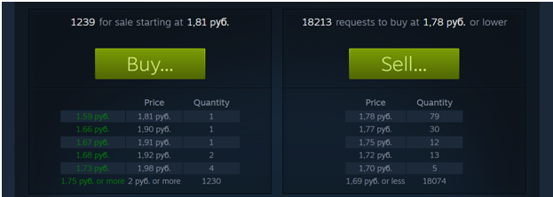

# Steam бот для создания выгодных ордеров

Существует платформа Steam - сервис, на котором можно приобрести игры.
В играх можно делать внутриигровые покупки - "скины на оружия, скины на персонажей и т.д.".
Существует внутренняя торговая площадка, где выложено огромное количество предметов, цены на которые меняются каждую секунду.
Пользователь может покупать эти скины по себестоимости, а может создать "ордер" на покупку по низкой цене, тем самым сэкономив часть баланса, а также в дальнейшем продать предмет по себестоимости и получить плюс с продажи. Но когда дойдет очередь до нашего ордера - неизвестно. Мы можем посмотреть график продаж предмета, посчитать его количество продаж и понять, сколько штук его покупают в день. Поставить такую цену на ордер, чтобы до нас дошла очередь в ближайшие дни. Однако, при большой базе предметов, очень сложно и долго выставлять ордера вручную. Поэтому это будет делать бот. 
P.S. Ниже описан подробный алгоритм определения цены для создания ордера.
Согласно ТЗ заказчика, программа должна из себя представлять графический интерфейс, где можно указать:
1)
1.логин аккаунта
2.пароль аккаунта
3.путь до excel таблицы с базой предметов
4.путь до mafile аккаунта.
О том, что такое mafile и как установить Steam Desktop Authentificator, можно ознакомиться здесь:
https://github.com/Jessecar96/SteamDesktopAuthenticator
Если коротко, то как известно, в Steam есть Mobile Authentificator (некий доступ к аккаунту в мобильном приложении), с помощью которого можно подтверждать все операции на аккаунте (продажа предметов, обмены и т.д.). На один аккаунт можно использовать один номер телефона. Но у заказчика более 1000 аккаунтов. Steam Desktop Authentificator позволяет хранить эти аккаунты и их Authentificator в одной папке. Для каждого аккаунта создаётся его собственный maFile файл, в котором указан специальный уникальный ключ, с помощью которого мы будем авторизовываться в Steam через API под соответствующим аккаунтом.

Ссылка на репозиторий с steampy: https://github.com/bukson/steampy

Сам интерфейс программы:

 

2)Можно выбрать количество аккаунтов, а также сохранять данные всех введённых полей ввода, чтобы не вводить их каждый раз при новом запуске.
3)После старта программа последовательно авторизуется в стиме под аккаунтом и смотрит список его активных ордеров (цена за единицу и количество), вычисляя их сумму.
4)Открывает excel таблицу и считывает строки.
Формат excel таблицы:
| ссылка на предмет steam | код предмета | процент |

 
Код предмета - на торговой площадке у каждого предмета есть свой код. Для его получения была написана программа.
Процент - устанавливает на каждый предмет сам заказчик. Чем больше процент - тем больше прибыли он получит при продаже предмета. Однако чем больше процент, тем меньше вероятность, что до него когда-нибудь дойдёт очередь.
Если предмет на какой-то строке уже есть в списке выставленный ордеров аккаунта, то мы пропускаем данный предмет. Иначе, необходимо узнать его выгодную цену.
Разработан следующий алгоритм:
Открываем предмет на странице (для примера рассмотрим  предмет https://steamcommunity.com/market/listings/753/34270-Alex)
 
 
 
 
 
При открытии предмета в браузере нам отображаются стаканы – данные и покупке и продажи предмета:

 
 
В левом стакане показаны предметы продавцов – их цены и количество всего предметов на данный момент, которые можно купить по этой же цене у других продавцов (несколько стенок на одной позиции означает, что предмет не в единственном экземпляре по данной цене).
В правом стакане отображаются покупатели, которые сделали ордера на эти предметы.
Бот должен:
1.брать историю продаж предмета за последнюю неделю и получать среднее арифметическое продаж в день. Данное число (среднее арифметическое продаж) обозначим как число s.
2.открывает левый стакан и начинает проходить по каждой позиции и складывать стенки на каждой позиции. Например на данном предмете на первой позиции одна стенка, на второй позиции одна стенка (суммарно первая и вторая дадут 2 стенки), третья позиция = 2 + 1 = 3, четвертая = 3 + 2 = 5 и так считаем, пока получившееся число не будет равно или превосходить число s – среднее количество продаж в день этого предмета. Если s = 4, то получается мы нашли позицию под номером четыре (т.к. 5 > 4), цена = 1.92. Теперь нужно вычесть 13%, получится число 1.67. Затем вычитаем 1 копейку и получаем 1.67 – 0.01 = 1.66. Теперь из 1.66 необходимо вычесть процент, который был указан в excel таблице на строчке с этим предметом (там число 10): 1.66 – 10% = 1.49. Сохраняем это число.
3.открывает правый стакан и начинает проходить по каждой позиции и складывать стенки на каждой позиции (как в левом стакане). Когда мы нашли ту самую позицию, на которой сумма стенок больше либо равна числу s (в данном примере s = 4, в правом стакане это первая позиция, 78 > 4), то берем цену: 1.78. Прибавляем 1 копейку, получаем 1.79. 
4.Если получившееся цена в правом стакане меньше либо равна получившейся цене из левого стакана, то мы создадим ордер на этот предмет по цене правого ордера. В данном примере создавать ордер не выгодно.

Теперь рассмотрим данный предмет: https://steamcommunity.com/market/listings/753/960090-Churchill

 
 
В среднем 503 продажи в сутки. Ищем цену в левом стакане:
Суммарно будет  507 стенок на 33 позиции. Цена позиции 3.12. Вычитаем 13%, получаем 2.71. Минус 1 копейка: 2.7. Отнимаем 10%, получаем 2.43.
В правом стакане это будет третья позиция (14 + 28 + 956) = 998 стенок. Это превышает 503, то что нам и нужно. Цена позиции, на которой мы достигли числа 503, равно 2.31. Прибавим 1 копейку, получим 2.32.
Цена правого стакана (2.32) меньше, чем цена левого стакана (2.43). Поэтому, на этот предмет выгодно создать ордер.

Так программа должна пройтись по каждому предмету.
После того, как она собрала данные для предметов, она, используя формулу, вычисляет необходимое количество стенок для каждого ордера.

 
 
Если сумма цены за ордер в 1 шт. умноженная на  полученное число c НЕ превышает баланса, умноженного на 10 и НЕ превышает фактического баланса кошелька, то мы выставляем ордер на данный предмет: наша стенка равна числу c, цена равна 2.32.
Данную цену мы сохраняем в excel таблице в строке с предметом и считаем среднее арифметическое значение всех цен.

 
 
Бот работает 24 часа в сутки и сканирует каждый предмет каждой таблицы каждого аккаунта.
